# Software-Defined Data Center (SDDC) — Design & Implementation

A working software-defined data center, built on physical hardware. Compute, storage and networking are all virtualised. On top of that platform run four production-style services:

- an Active Directory domain;
- Citrix application delivery;
- a web server;
- Exchange e-mail.

Every layer was installed, configured and tested end to end. The design follows the SDDC model: workloads run on logically defined resources, abstracted from the underlying hardware.

> **Team project** covering design, implementation, configuration, testing and technical documentation.

**Stack:** VMware ESXi 5.5 · vSphere Client · FreeNAS 11 (ZFS) · iSCSI · vSwitch / NIC teaming · Windows Server 2008 R2 · Active Directory / DNS / DHCP · Citrix XenApp 6.5 · AppServ (Apache 2.2, PHP 5, MySQL 5.1, phpMyAdmin) · Exchange Server 2013

---

## Contents

1. [Repository layout](#repository-layout)
2. [Architecture](#architecture)
3. [Hardware](#hardware)
4. [Storage virtualisation — FreeNAS over iSCSI](#1-storage-virtualisation--freenas-over-iscsi)
5. [Compute virtualisation — ESXi 5.5 and vSphere](#2-compute-virtualisation--esxi-55-and-vsphere)
6. [Network virtualisation — vSwitch and NIC teaming](#3-network-virtualisation--vswitch-and-nic-teaming)
7. [Application virtualisation — Citrix XenApp 6.5](#4-application-virtualisation--citrix-xenapp-65)
8. [Web server — AppServ (Apache, PHP, MySQL)](#5-web-server--appserv-apache-php-mysql)
9. [E-mail server — Exchange Server 2013](#6-e-mail-server--exchange-server-2013)
10. [Results](#results)
11. [Technical background](#technical-background)

---

## Repository layout

```
sddc-lab-implementation/
├── README.md                        ← this document
├── config/
│   ├── freenas/iscsi-setup.md       ← iSCSI configuration order (portal → initiators → CHAP → target → extent → LUN)
│   ├── apache/httpd.conf.changes    ← Apache changes on the web-server VM
│   ├── php/php.ini.changes          ← PHP settings
│   └── exchange/mailbox-admin.ps1   ← Exchange Management Shell commands used
└── docs/images/                     ← screenshots from the implementation
```

---

## Architecture

<p align="center">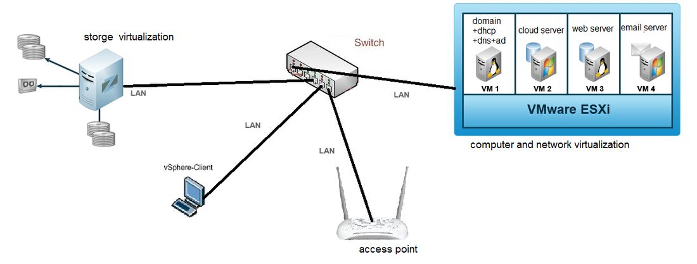</p>

```
 FreeNAS 11 storage server (ZFS, iSCSI LUN) ──┐
 Management laptop (vSphere Client) ──────────┼── 8-port switch ── VMware ESXi 5.5 host
 Wi-Fi access point (clients) ────────────────┘                     │
                                                                    ├─ VM1  Domain controller: AD, DNS, DHCP
                                                                    ├─ VM2  Cloud server: Citrix XenApp 6.5
                                                                    ├─ VM3  Web server: AppServ (Apache, PHP, MySQL)
                                                                    └─ VM4  E-mail server: Exchange 2013
```

| Layer | Implementation |
|---|---|
| Compute virtualisation | VMware ESXi 5.5 (type-1 hypervisor), managed with vSphere Client |
| Storage virtualisation | FreeNAS 11 on a dedicated server, presented to ESXi over iSCSI as shared block storage |
| Network virtualisation | ESXi standard vSwitch with network labels, optional VLAN IDs and NIC teaming (active / standby) |
| Physical network | 8-port switch and a Wi-Fi access point on one LAN |

---

## Hardware

| Role | Hardware | OS / software |
|---|---|---|
| Virtualisation host | Intel Core i7-3720QM (8 threads, 2.6 GHz), 20 GB DDR3, 500 GB SATA | VMware ESXi 5.5 |
| Storage server | AMD Opteron 2220 SE (2.8 GHz), 16 GB DDR3, 2 × 73 GB 15k rpm SAS + 160 GB SATA | FreeNAS 11 |
| Management / client | Intel Core i3-2350M, 6 GB DDR3, 128 GB SSD | Windows 7 x64, vSphere Client, Citrix Receiver |
| Network | TP-Link TL-SF1008D 8-port switch, TP-Link TL-WR841ND access point | — |

---

## 1 · Storage virtualisation — FreeNAS over iSCSI

The storage server runs FreeNAS 11 and turns its disks into a ZFS volume. That volume is exported as an iSCSI LUN, which the ESXi host uses as shared, SAN-style block storage over the existing Ethernet network.

1. **Volume Manager:** built the ZFS volume from the SAS and SATA disks.
2. **iSCSI target global configuration:** set the base name and global options.
3. **Portal:** the IP address and port the target listens on.
4. **Initiators:** authorised the ESXi host and its network.
5. **Authorized access:** set up CHAP and mutual CHAP.
6. **Target:** created the target and linked the portal and initiator groups to it.
7. **Extent:** added a device extent to back the LUN.
8. **Target–extent association:** linked the target to the extent, which forms the LUN.
9. **Service:** started the iSCSI service and added the LUN on ESXi as a datastore.

Full order and settings: [`config/freenas/iscsi-setup.md`](config/freenas/iscsi-setup.md)

<p align="center">
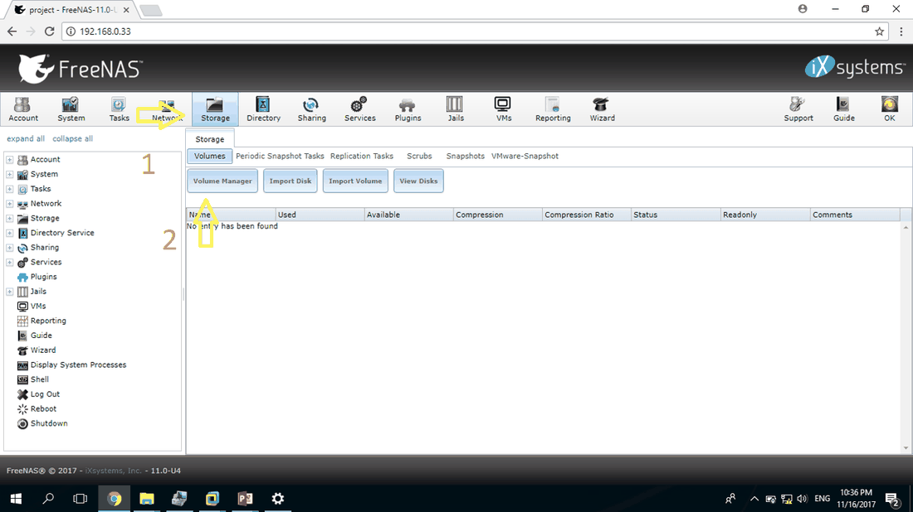
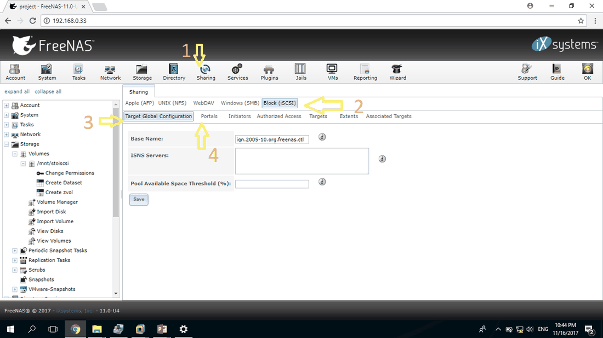
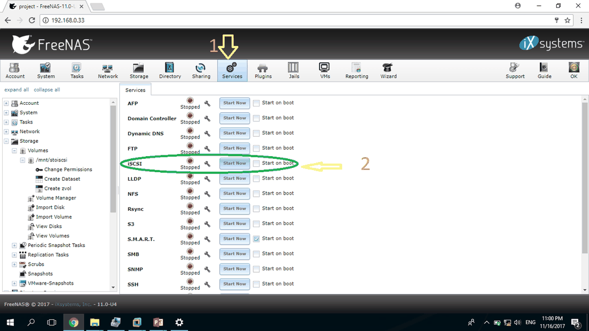
</p>
<p align="center"><sub>Volume Manager · iSCSI portal and initiators · target–extent association</sub></p>

---

## 2 · Compute virtualisation — ESXi 5.5 and vSphere

1. **Install.** Installed ESXi 5.5 on the host from the ISO.
2. **Management network (DCUI).** Set a static IP address, subnet and gateway, the primary and alternate DNS servers, and the hostname `ESX1`.
3. **Connect.** Connected to the host from the management laptop with vSphere Client.
4. **Build the VMs.** Created the four VMs, setting for each:
   - the guest OS;
   - the vCPU count and memory;
   - the disk, choosing thick or thin provisioning;
   - a virtual NIC on the VM network.

   Each VM's OS was installed from an ISO image uploaded to the datastore.

<p align="center">
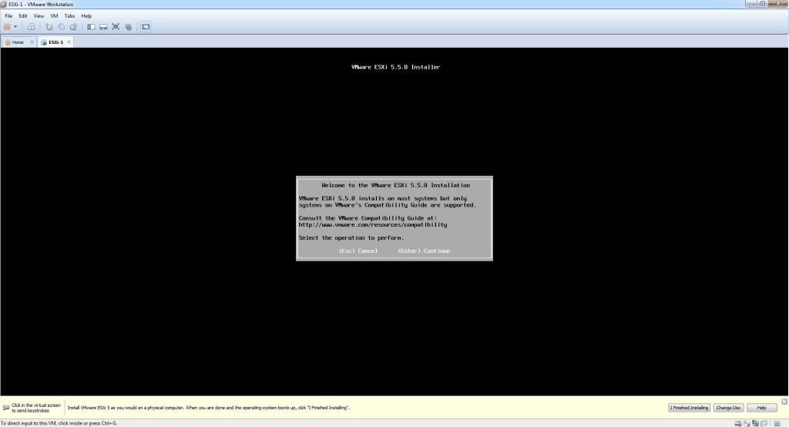
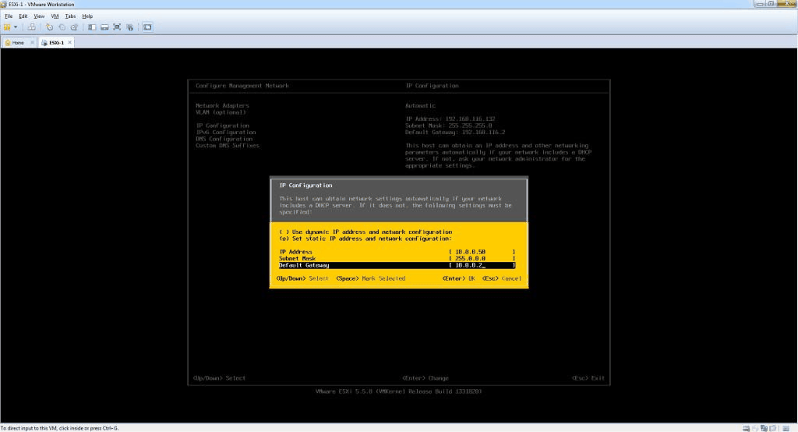
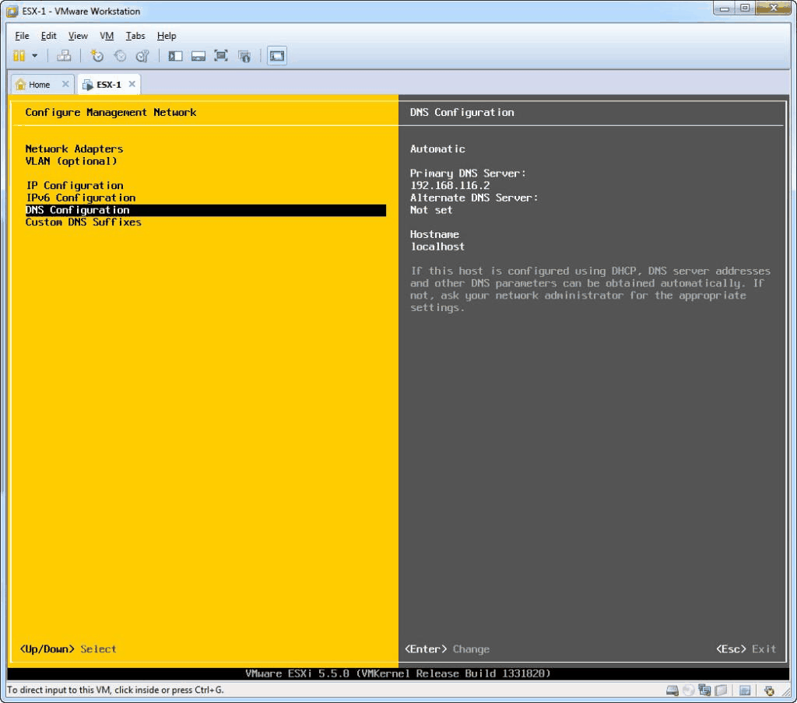
</p>
<p align="center">
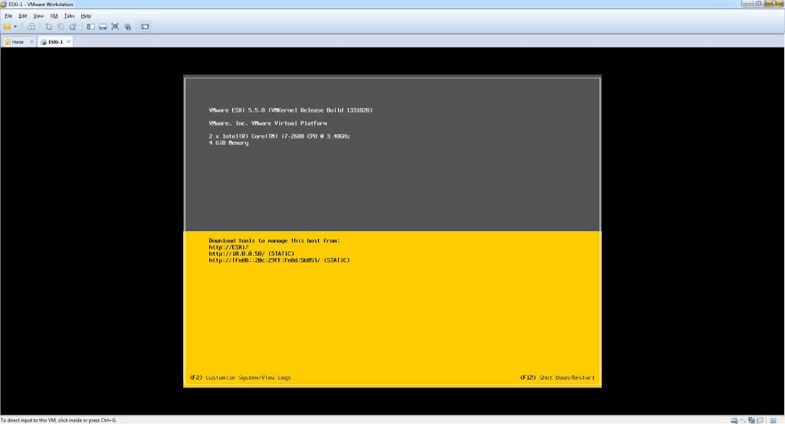
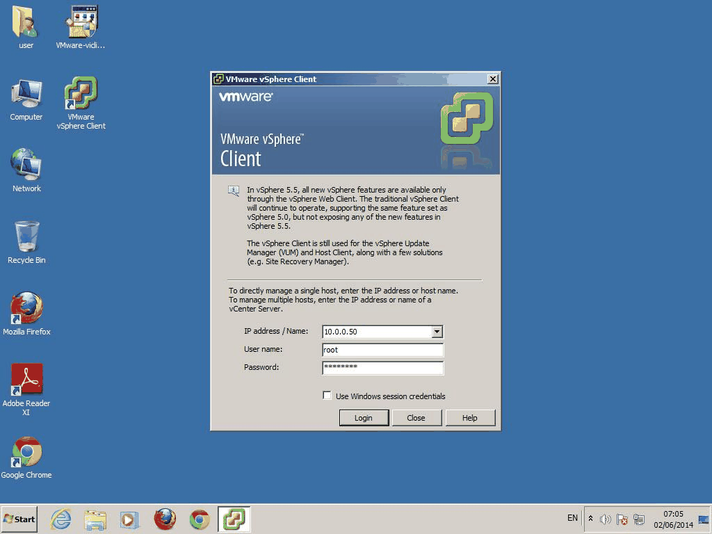
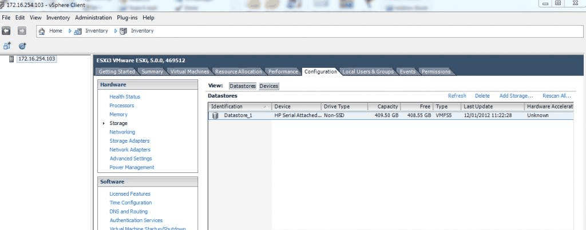
</p>
<p align="center">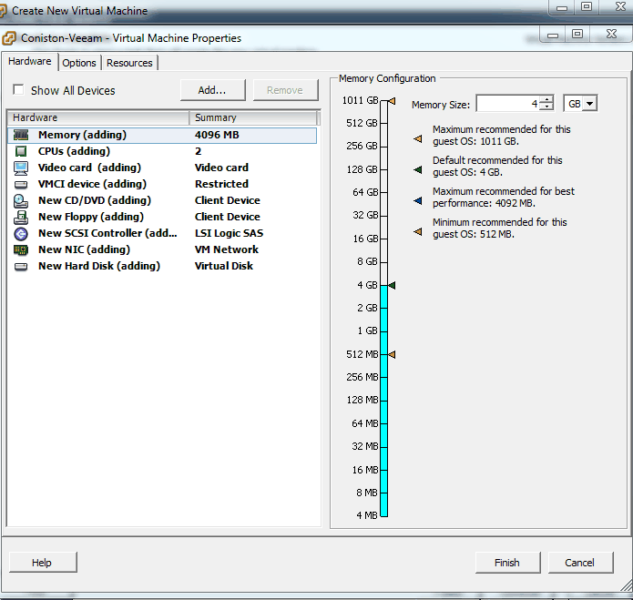</p>

---

## 3 · Network virtualisation — vSwitch and NIC teaming

- **vSwitch.** Created a standard vSwitch for virtual-machine traffic (vSphere Client → Configuration → Networking → Add Networking → Virtual Machine). It has its own network label and an optional VLAN ID; the default is none (0).
- **NIC teaming.** Added a second physical adapter to the vSwitch. One uplink was set to active and the other moved down to standby, so traffic fails over if the active link drops.

<p align="center">
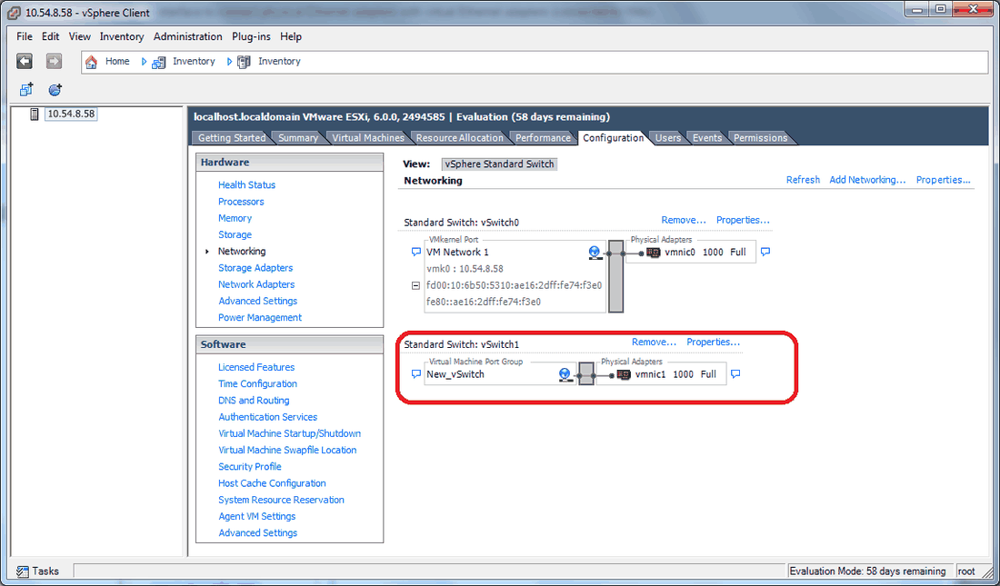
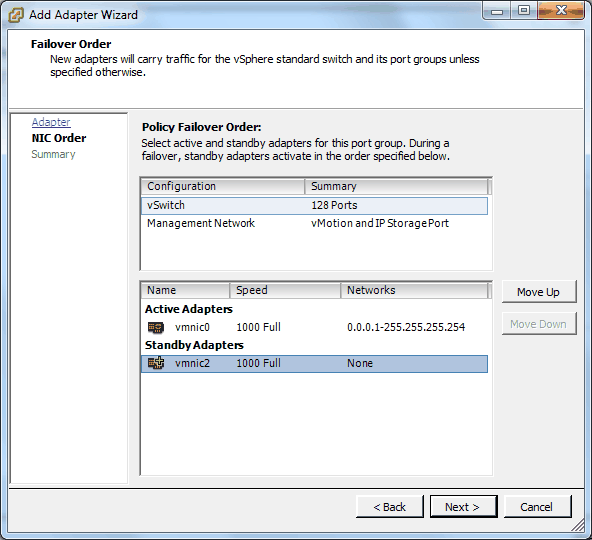
</p>
<p align="center"><sub>Standard vSwitch on the host · NIC teaming with one active and one standby adapter</sub></p>

---

## 4 · Application virtualisation — Citrix XenApp 6.5

The cloud-server VM delivers Windows applications that run centrally on the server, so client devices do not need them installed.

1. **Install.** Installed the XenApp server role with XenApp Management, so the server acts as both controller and session host.
2. **Configure:**
   - pointed the server at the license server and confirmed the connection;
   - created a new server farm;
   - used an existing Microsoft SQL Server database as the farm data store, with service-account credentials, and tested the connection;
   - left the XML Service on port 80;
   - set up the Receiver / Web Interface options and Remote Desktop Users.
3. **Publish.** In Citrix AppCenter, published an application (Notepad, from `C:\Windows\System32\notepad.exe`) to the farm's servers. Domain users `TU1` and `TU2` were given access to it.
4. **Client access.** Installed Citrix Receiver Enterprise on the client and allowed the ActiveX add-on. Then signed in through the XenApp web interface as `TU2` and launched the published application.

<p align="center">
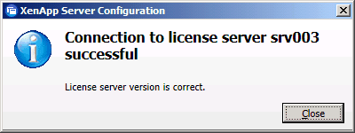
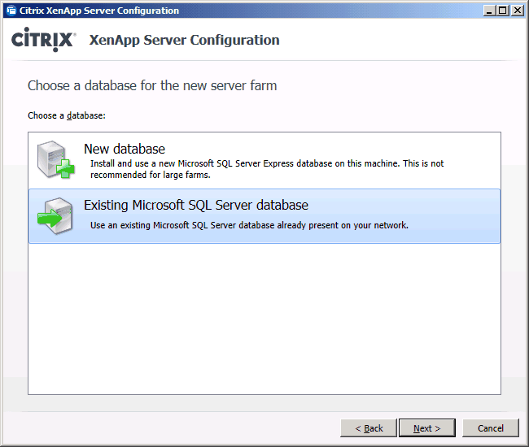
</p>
<p align="center">
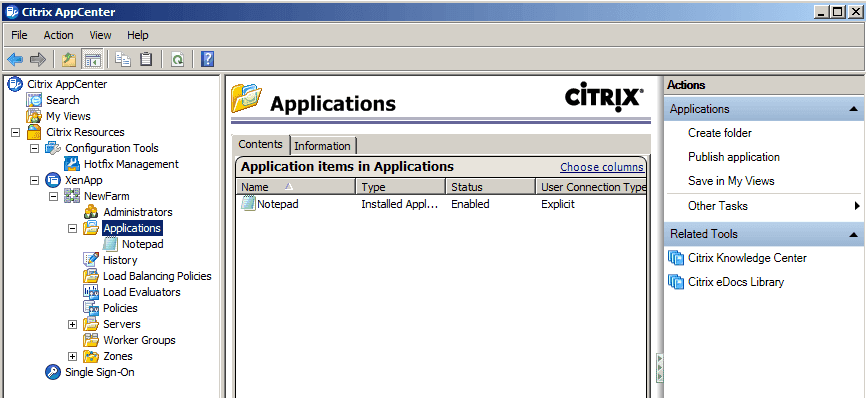
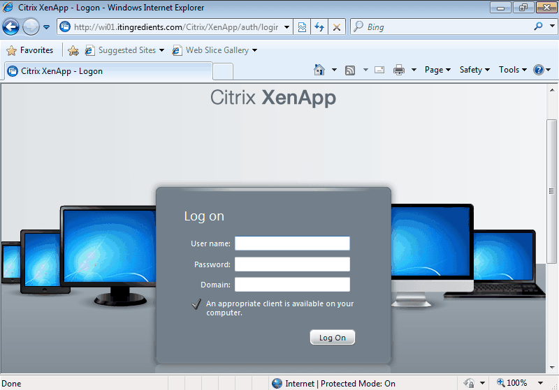
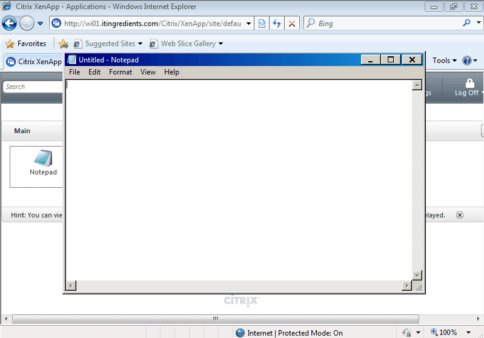
</p>

---

## 5 · Web server — AppServ (Apache, PHP, MySQL)

1. **Layout.** Created `C:\dev\progs\` for the binaries and `C:\dev\www\` as the web root. Updated the `hosts` file so `localhost` resolves to `127.0.0.1`.
2. **Apache 2.2:**
   - set the server name and administrator e-mail;
   - enabled `mod_rewrite`;
   - moved `DocumentRoot` to `C:/dev/www` with `AllowOverride All`;
   - added `index.php` to `DirectoryIndex` and registered the PHP handler.
3. **PHP 5:**
   - installed as an Apache module;
   - raised the memory, post and upload limits;
   - enabled error display for development;
   - set the time zone.
4. **MySQL 5.1:**
   - ran the detailed instance configuration with TCP/IP on port 3306 and a firewall exception;
   - enabled strict mode and multilingual (UTF-8) character sets;
   - installed it as a Windows service.
5. **phpMyAdmin** for database administration. The site was deployed to `C:\dev\www\sanaa\` and served at `http://localhost/sanaa`.

```apache
# httpd.conf — key changes (full list: config/apache/httpd.conf.changes)
LoadModule rewrite_module modules/mod_rewrite.so
DocumentRoot "C:/dev/www"
<Directory "C:/dev/www">
    Options Includes Indexes FollowSymLinks MultiViews
    AllowOverride All
</Directory>
DirectoryIndex index.html index.htm index.php
AddType application/x-httpd-php .php
PHPIniDir "C:/dev/progs/PHP/"
LoadModule php5_module "C:/dev/progs/PHP/php5apache2_2.dll"
```

```ini
; php.ini — key changes (config/php/php.ini.changes)
memory_limit = 512M
post_max_size = 100M
upload_max_filesize = 2000M
display_errors = On
```

<p align="center">
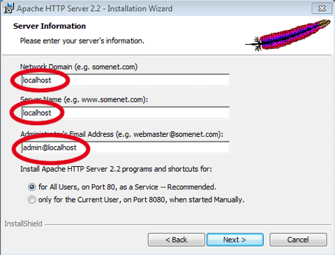
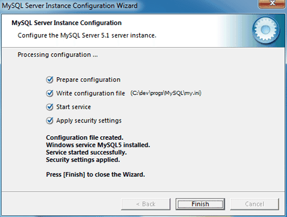
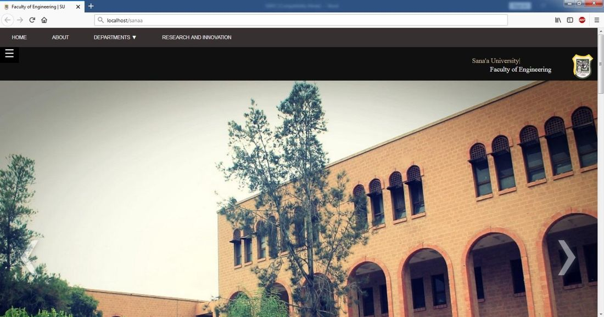
</p>

---

## 6 · E-mail server — Exchange Server 2013

Exchange 2013 was installed on the Active Directory domain hosted by VM1. It is administered through the Exchange Admin Center (`https://<server>/ecp`), and users reach their mail through OWA (`https://<server>/owa`).

- **Mailbox database.** Moved the database file to a dedicated disk with `Move-DatabasePath`.
- **Mailboxes:**
  - user mailboxes created through the EAC;
  - bulk-enabled for a whole OU from the Exchange Management Shell;
  - delegation set up (*Send As* / *Send on Behalf*).
- **Groups and recipients:**
  - distribution, security and dynamic groups;
  - room and equipment resource mailboxes;
  - mail contacts for external addresses;
  - a shared company mailbox.
- **Mail flow:**
  - send and receive connectors;
  - accepted domains and e-mail address policies;
  - transport rules (message size limits);
  - delivery reports.
- **Policies.** OWA / Outlook Web App policies, controlling feature access, file access and offline access.

```powershell
# config/exchange/mailbox-admin.ps1
Move-DatabasePath -Identity "Mailbox Database 0252873693" `
                  -EdbFilePath "J:\exdb\Mailbox Database 0252873693.edb"

Get-User -OrganizationalUnit "<OU>" |
    Where-Object { $_.RecipientType -eq "User" } |
    Enable-Mailbox -Database "<Database>"
```

<p align="center">
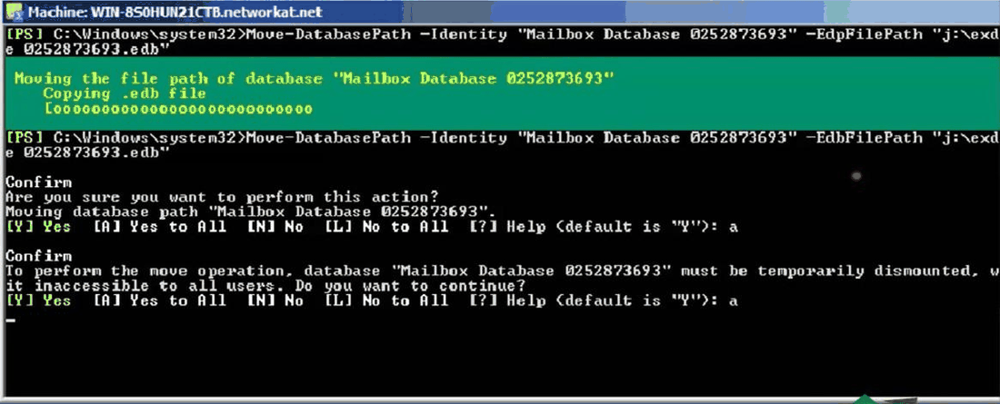
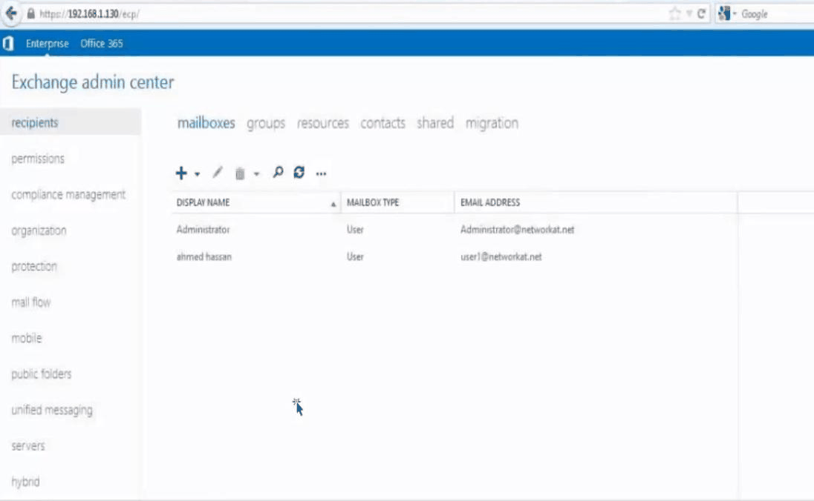
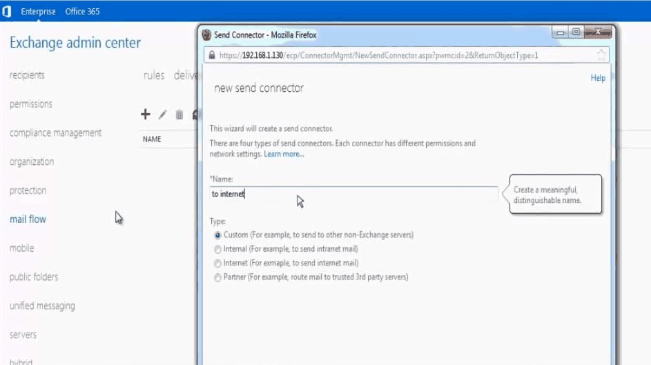
</p>

---

## Results

- **Storage:** a FreeNAS iSCSI LUN served as shared block storage for the ESXi host over standard Ethernet, with CHAP authentication.
- **Compute:** a single ESXi 5.5 host ran four server VMs, all managed centrally from vSphere Client.
- **Network:** the vSwitch's NIC teaming gave the VM network a standby uplink.
- **Applications:** a published application was delivered through Citrix XenApp to a domain user on a client device.
- **Web and mail:**
  - the web server served the PHP/MySQL site;
  - Exchange provided domain e-mail, groups, resource mailboxes and controlled mail flow.

## Technical background

The documentation also covers the concepts behind the implementation:

- **SDDC:** architecture, cloud management and multi-tenant trust boundaries.
- **Storage networking:** DAS, NAS and SAN; SCSI, Fibre Channel, FCIP and IP SAN; storage virtualisation.
- **Network virtualisation:** how it compares with SDN, and the role of hypervisors.
- **Virtualisation and cloud computing:** service and deployment models.
- **Mail and web servers:** SMTP, POP3 and IMAP.

---

**Author:** Mohammed Mahyoub · [Portfolio](https://mahyoub88.github.io/) · [LinkedIn](https://www.linkedin.com/in/mohammed-mahyoub/) · [ORCID](https://orcid.org/0009-0003-5640-352X)
