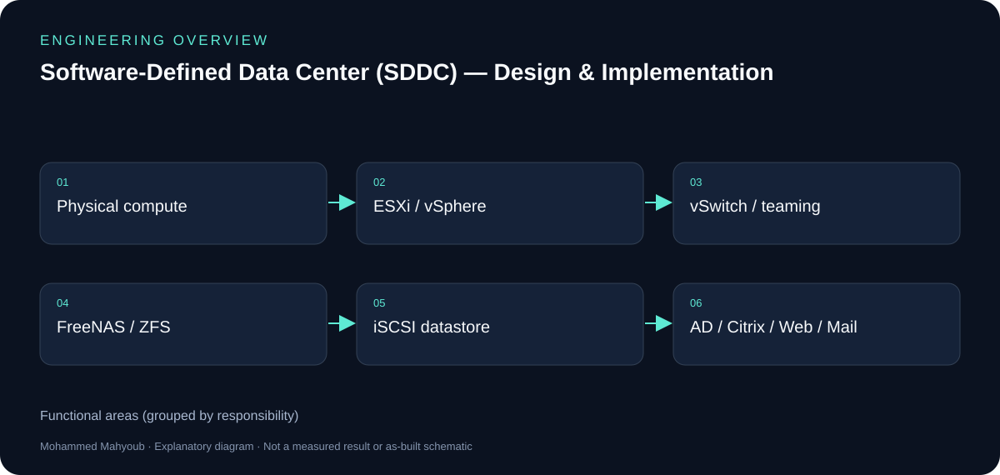
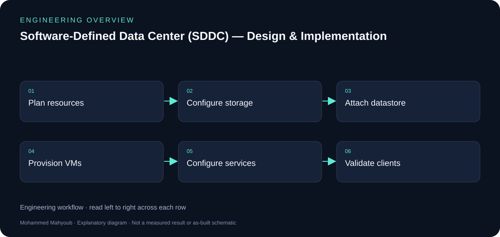

# Software-Defined Data Center (SDDC) — Design & Implementation — Engineering Guide

Designed and implemented a working software-defined data center on physical hardware, virtualising compute, storage and networking and hosting directory, cloud-application, web and e-mail services.

## Visual overview

*New explanatory diagram; grouped responsibilities, not an as-built schematic or test result.*

*New explanatory workflow; a documentation aid, not evidence that every proposed check was performed.*

## Storage-to-service dependency

FreeNAS exports ZFS-backed storage as an iSCSI target; ESXi attaches the LUN as a datastore. Virtual machines then use compute and network resources to host directory, application-delivery, web and email services. This dependency chain makes storage faults visible far above the storage layer.

## Networking and identity

A standard vSwitch provides VM connectivity and active/standby NIC teaming. AD, DNS and DHCP support domain users and service discovery; Citrix, the AppServ stack and Exchange provide distinct application services. Configuration screenshots document the integration steps.

## Reading historical configurations

Version numbers describe the documented implementation. The repository is a record of the engineering work, not a recommendation to expose those historical server versions as a new public production deployment. The new diagram is a simplified logical view.

## Evidence to review or collect

The following are suggested review checks. A checklist entry is not a claimed pass result.

- iSCSI target/LUN/datastore chain.
- VM resource and vSwitch configuration.
- Directory/DNS and application access.
- Storage/network interruption and recovery evidence.

## Source gallery

*lab architecture.*

*freenas volume manager.*

*freenas iscsi portal initiators.*

*freenas iscsi target extent.*

*esxi install.*

*esxi static ip.*

*esxi dns hostname.*

*esxi configured.*

*vsphere client login.*

*vsphere host inventory.*

*vm hardware settings.*

*vswitch created.*

*nic teaming failover order.*

*xenapp license server.*

*xenapp sql data store.*

*xenapp published apps.*

*citrix web interface login.*

*citrix published app running.*

*apache server settings.*

*mysql instance config.*

*sanaa website served.*

*exchange powershell.*

*exchange send connector.*

## Sources and provenance

- [Published portfolio description](https://mahyoub88.github.io/#proj-sddc-lab).
- [Project README](../README.md) and existing repository files.
- [LinkedIn projects](https://www.linkedin.com/in/mohammed-mahyoub/details/projects/): supplementary descriptions and project media.
- New SVG figures and explanatory text were authored for this documentation update; they are not original photographs or new measured results.
